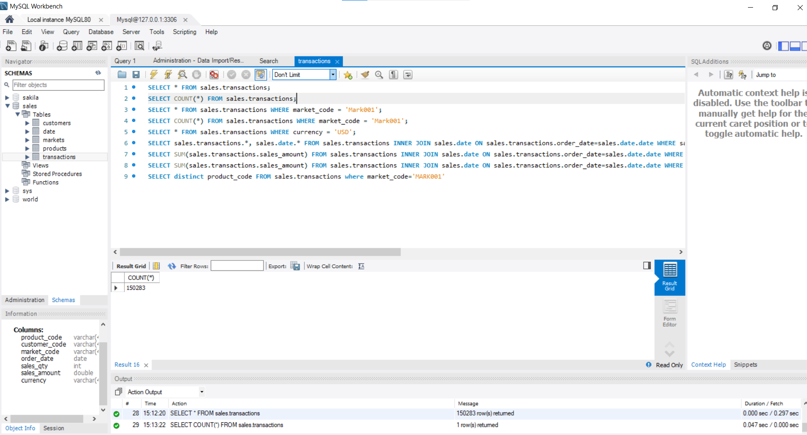
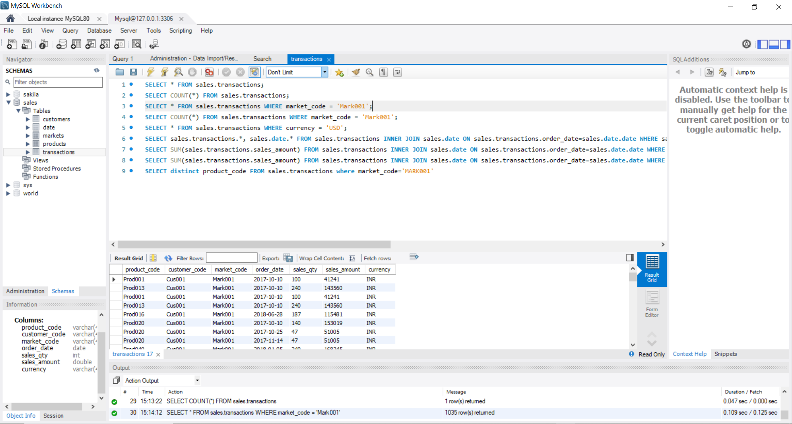
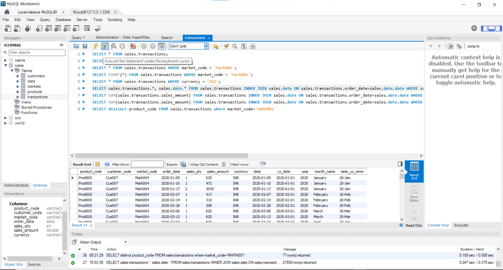
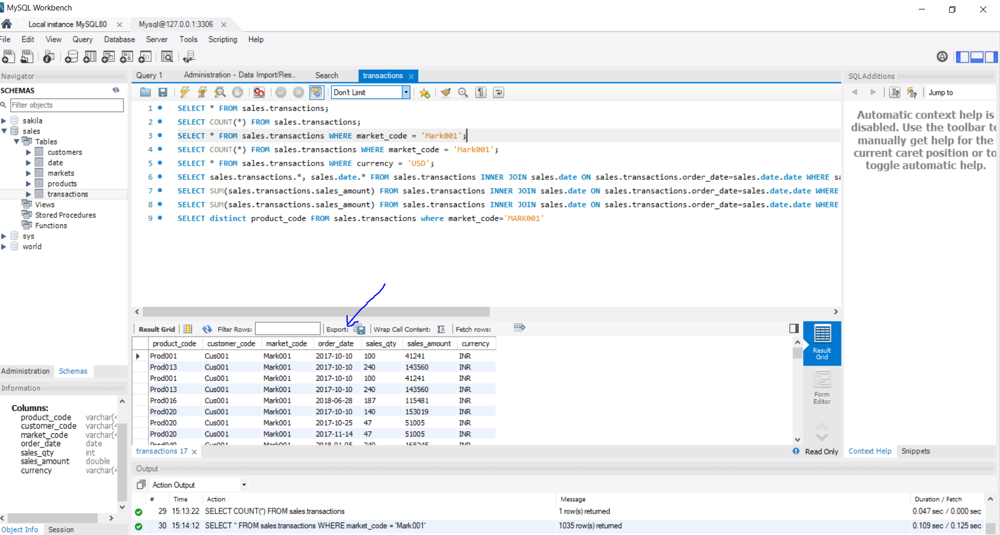

# Power BI Project for Sales Insights

`Overview`

This project focuses on data analysis to generate sales insights for a computer hardware manufacturer, AtliQ Hardware. It aims to provide hands-on experience in executing data analysis projects in a corporate environment, which is valuable for aspiring data analysts and scientists.
It is part of Codebasics’ Power BI course and focuses on analyzing sales data to uncover actionable insights. The ultimate goal is to create an interactive and visually compelling dashboard answering key business questions, such as:

- What are the trends in sales performance?
- Which regions are most profitable?
- How can the business optimize its operations?

## Project Breakdown

`1. Problem Statement`

AtliQ Hardware supplies computer hardware to clients across India and faces challenges in tracking sales due to dynamic market conditions. The sales director, Bhavan Patel, struggles with obtaining clear insights from regional managers, who often provide verbal reports that may not accurately reflect the sales data.

`2.Challenges Identified`

The reliance on verbal communication leads to a lack of trust in the data provided. Managers tend to sugarcoat the facts, resulting in confusion and frustration for Bhavan Patel, who seeks straightforward, digestible insights rather than numerous Excel files.
The need for a visual dashboard is emphasized, as it would allow Bhavan to quickly assess sales trends and make data-driven decisions.

`3.Project Execution Steps`

The project will be divided into several parts, starting with defining the problem and strategy using the Ames grid. Subsequent steps include data discovery, cleaning, merging, and ultimately creating a Power BI dashboard.

`4. Expected Outcomes`

The end product will be a comprehensive Power BI dashboard that tracks revenue and sales quantities year-over-year, providing insights by region and product. Participants will also receive the dashboard and act as stakeholders, providing feedback for improvements.

`5. Importance of Data Visualization`

A well-structured dashboard will enable Bhavan Patel to visualize sales data effectively, allowing for timely and informed decision-making. This aligns with the principle that "a picture is worth a thousand words," emphasizing the need for clear data representation.

`6. Conclusion`

This project not only aims to enhance technical skills in Power BI but also focuses on understanding the corporate context of data analysis.

## Data Analysis Using SQL
We explore data analysis using SQL, specifically targeting insights from a sales database. The focus is on performing SQL queries to extract valuable information for data analysts.

`Key Steps in Data Analysis`

- Setting Up MySQL:

Install MySQL server and MySQL Workbench to manage databases and run SQL queries. Follow the installation instructions provided in the linked video.

- Database Access:

The software engineering team provides access to the MySQL database for the data analysis team, allowing them to run queries and generate insights. 

- Importing Data:

Download the SQL dump file from GitHub to create the sales insights database. Use the data import feature in MySQL Workbench to load the database. 

- Exploring Tables:

Familiarize yourself with the structure of the database, including key tables like customers, transactions, and products. For example, the transactions table contains columns such as product code, customer code, order date, sales quantities, and amount.

- Running SQL Queries:

Use SQL queries to analyze data. For instance, to count total transactions, use:

`SELECT COUNT(*) FROM sales_transaction;`

This query returns the total number of records in the transactions table. 5

- Filtering Data:

To focus on specific markets, such as Chennai, use a WHERE clause:

`SELECT * FROM sales_transactions WHERE market_code = 'MRK001';`

This retrieves all transactions for Chennai(MARK001). 

- Handling Currency and Data Cleaning:

Identify and convert currencies (e.g., USD to INR) for accurate revenue calculations. Address issues like negative sales amounts and data inconsistencies. 

-Aggregating Data:

To calculate total revenue for a specific year, use:

`SELECT SUM(sales.transactions.sales_amount) FROM sales.transactions INNER JOIN sales.date ON sales.transactions.order_date=sales.date.date WHERE sales.date.year='2020';`

This provides insights into revenue trends over time. 

- Using Joins:

`SELECT sales.transactions.*, sales.date.* FROM sales.transactions INNER JOIN sales.date ON sales.transactions.order_date=sales.date.date WHERE sales.date.year='2020';`

Combine data from multiple tables using JOIN operations to enrich analysis. For example, joining transactions with a date table to filter by year. 9

- Exporting Results:

After analysis, results can be exported to CSV for reporting purposes. This is useful for sharing insights with stakeholders. 

- Conclusion
SQL is a powerful tool for data analysts, enabling them to extract, clean, and analyze data efficiently. This series provides a foundational understanding of how to leverage SQL for generating sales insights, preparing analysts for real-world data challenges.