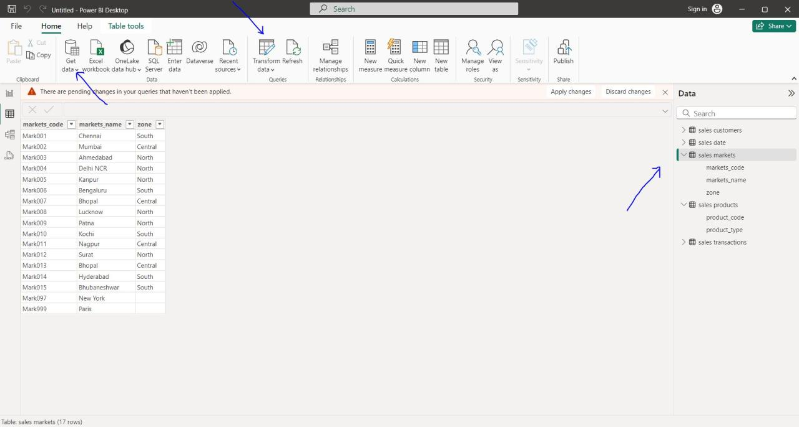

# Data Cleaning and Preparation

I used Power Query to clean and transform raw data into a usable format.
I explored how to use Power BI for data analysis, focusing on data cleaning and ETL (Extract, Transform, Load) processes using a MySQL database.

Connecting to MySQL Database
1.Getting Data: Launch Power BI and click on "Get Data" to connect to your MySQL database. You will need to enter the connection info, such as the server (localhost) and database name (sales). 2
2.Authentication: Use the default username (root) and password (blank or root) to connect. 

Data Transformation (ETL Process)
1.Power Query Editor: Once connected, you can transform your data using Power Query. This includes filtering out unnecessary values and cleaning the data. 
2.Filtering Data: For instance, filter out locations like New York and Paris from the markets table. 

3. Handling Negative Values: Remove any sales transactions with a sales amount of -1 or 0, as these are considered garbage data. 6
4. Currency Normalization: Convert sales amounts from USD to INR. Create a new column for normalized sales amounts using a conversion rate (e.g., 75 INR = 1 USD). 7